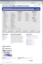

Title: Faire un screenshot d'une page web en entier
Date: 2008-03-24 22:50
category: howto
tags: browsershots

Je connaissais des extensions qui faisaient ça (plutôt mal, d'ailleurs, et
parfois de manière payante), mais je viens de découvrir qu'il existe
désormais un site qui fait ça gratuitement: [browsershots.org][1]. En ça
sert surtout si vous voulez déboguer votre site puisque, vous pouvez
choisir différents navigateurs et vous allez obtenir les rendus pour
chacun de ces browser. Mais ça peut avoir aussi d'autres applications, si
par exemple vous souhaitez présenter dans un article un nouveau site à vos
lecteurs, ou bien mettre des photos de sites dans des transparents. Pour
le fun, parce que j'aime bien la récursivité (geek inside), je l'ai fait
se prendre lui-même en photo :) Voici le rendu sous firefox 2 ubuntu.

[][2]

Amusez-vous bien.

[1]: http://browsershots.org/
[2]: static/images/screenshot_recursif.png
