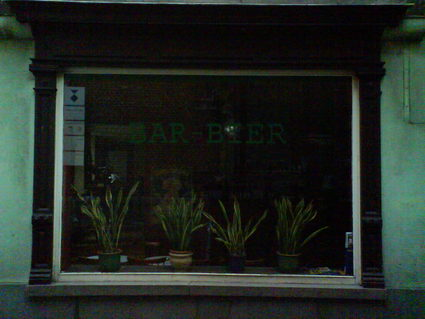

Title: Using Operations Research for better beer drinking.
Category: misc
Date: 2011-09-17 17:22

If you are a little bit into beer, you probably know Belgium produces
among the best beers in the world. You also probably know about the
[trappist beers][1], which are some of the most famous and the most
tastiest beers brewed in the area.

Two years ago, [one of my friends][2] had a crazy idea: He looked at a
map, locating the trappist abbeys producing those excellent beers, and
noticed they all were in the same area and not too far from each other. He
thus proposed a tour of Belgium that would visit all of them, by bicycle.
I was immediately very enthusiastic about the idea and started to think
about how to make it become true.

Planning the trip
-----------------

The first question about this tour was: How to do it efficiently? Since we
would do it by bicycle, we had to use the shortest tour in order not to
waste too much time on the road. As a good Operations Research student, I
knew this would require to solve an instance of the [TSP][3], which is
proven to be a NP-hard problem. Fortunately, with only seven abbeys to
visit (at the time, since very recently the french abbey of [Mont des
Cats][4] and the german abbey of [Maria Toevlucht][5] both announced their
plan of brewing their own beers recently) this instance was solvable. I
used [the online solver][6] from the very good [TSP website][7] of the
university of Georgia Tech to plan the trip. Then, since I did not need to
travel back to the first abbey, I removed the longest edge.

Do you see my mistake here? I assumed I needed to solve a TSP while I
actually needed to solve an Hamiltonian path. Both problems are NP-hard,
but they are not the same.

Doing it!
---------

Here is the trip as we planned it:

<iframe width="425" height="350" frameborder="0" scrolling="no" marginheight="0" marginwidth="0" src="http://maps.google.com/maps?f=d&amp;source=s_d&amp;saddr=Chimay+%4050.048397,4.311786&amp;daddr=Orval,+Florenville,+Belgique+to:Rochefort,+Belgique+to:Achel,+Hamont,+Belgique+to:Koningshoeven,+5018+Tilburg,+Pays-Bas+to:Westmalle,+Royaume+de+Belgique+to:Westvleteren,+Vleteren,+Belgique&amp;hl=fr&amp;geocode=FY2t-wId6spBAA%3BFdpj9QIde5ZRACkjJ_77zo3qRzFW8laZ9FhaqQ%3BFRNr_QIdk6hPACljFprIRsnBRzEgb00vq5kABA%3BFREaDgMd-JhTACEenFGS3R3vUg%3BFWedEgMda_5NACkzdA2EwL_GRzFeLGHzqkBolg%3BFRq7DgMdVpRHACnVxaCIOgDERzECXL1iQqISzg%3BFdwXCQMdSHUpACmNKhq7IsHcRzGWOA_eggi1yQ&amp;sll=50.513427,4.65271&amp;sspn=2.109882,4.916382&amp;vpsrc=0&amp;dirflg=w&amp;mra=ltm&amp;ie=UTF8&amp;ll=50.513427,4.65271&amp;spn=1.93717,2.76712&amp;t=h&amp;output=embed"></iframe> <small><a href="http://maps.google.com/maps?f=d&amp;source=embed&amp;saddr=Chimay+%4050.048397,4.311786&amp;daddr=Orval,+Florenville,+Belgique+to:Rochefort,+Belgique+to:Achel,+Hamont,+Belgique+to:Koningshoeven,+5018+Tilburg,+Pays-Bas+to:Westmalle,+Royaume+de+Belgique+to:Westvleteren,+Vleteren,+Belgique&amp;hl=fr&amp;geocode=FY2t-wId6spBAA%3BFdpj9QIde5ZRACkjJ_77zo3qRzFW8laZ9FhaqQ%3BFRNr_QIdk6hPACljFprIRsnBRzEgb00vq5kABA%3BFREaDgMd-JhTACEenFGS3R3vUg%3BFWedEgMda_5NACkzdA2EwL_GRzFeLGHzqkBolg%3BFRq7DgMdVpRHACnVxaCIOgDERzECXL1iQqISzg%3BFdwXCQMdSHUpACmNKhq7IsHcRzGWOA_eggi1yQ&amp;sll=50.513427,4.65271&amp;sspn=2.109882,4.916382&amp;vpsrc=0&amp;dirflg=w&amp;mra=ltm&amp;ie=UTF8&amp;ll=50.513427,4.65271&amp;spn=1.93717,2.76712&amp;t=h" style="color:#0000FF;text-align:left">Show a bigger version</a></small>

We ended up being two (me and my flatmate of the time - Mickael could not
make it) with train tickets to Belgium. Cool facts about this trip:

- We discussed with "le grand maître de [la confrérie de la grusalle et de
  la trappiste de Rochefort][14]".

- We drank some "petit orval", a beer that you can find only at the abbey
  and at the bar ([l'auberge de l'Ange Gardien][13]) and we learned about
  the [legend of Orval][12].
- The lady at the little shop in front of the abbey of Koningshoven (the
  one that brews [la Trappe][8]) was so amazed of what we were doing that
  she gave us a pack of 4 beers that we brought back to France.
- In Gent, there is a barber which is called [bar-bier][12], who (I
  believe) serves bier while shaving the clients.

- Gent and Antwerpen are two of the most beautiful cities I have ever
  seen.

The only sad thing about it is that we could not get to drink any
Westvleteren : it is actually [quite hard to get some][9], given the fact
the monks over there have chosen to only produce as much beer as needed to
finance the community: when we arrived, they did not have any beer left.

Conclusion
----------

Last month (and that is what motivated me to write this article), a friend
of mine had the opportunity to get some Westvleteren and he invited me to
taste them, offering me the opportunity to "finish my trip". For the
record, the Westvleteren 12 is ranked the best beer in the world by
[ratebeer.com][10]. Needless to say, I enjoyed it very much. I also kept
the capsules as a souvenir:

I realized this story was the perfect opportunity to share my feeling that
Operations Research is everywhere. I hope you enjoyed it!

[][11]

[1]: http://en.wikipedia.org/wiki/Trappist_beer
[2]: http://mickaelistria.wordpress.com/
[3]: http://en.wikipedia.org/wiki/Travelling_salesman_problem
[4]: http://fr.wikipedia.org/wiki/Abbaye_du_Mont_des_Cats
[5]: http://trappist-beers.com/8th-trappist-beer-not-from-mont-des-cats-france-but-from-abbey-zundert-netherlands/
[6]: http://www.tsp.gatech.edu/maps/index.html
[7]: http://www.tsp.gatech.edu/index.html
[8]: http://fr.wikipedia.org/wiki/La_Trappe
[9]: http://en.wikipedia.org/wiki/Westvleteren_Brewery#Availability
[10]: http://www.ratebeer.com/
[11]: images/belgium_trip.jpg
[12]: http://en.wikipedia.org/wiki/Orval_Abbey#The_legend_of_Orval
[13]: http://www.orval.be/fr/accueil/auberge.html
[14]: http://www.confreries.be/conf/grusalle/index.htm
