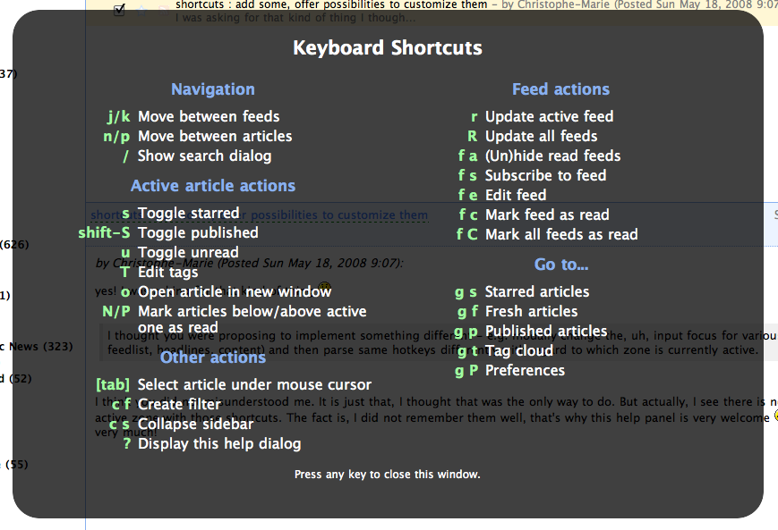
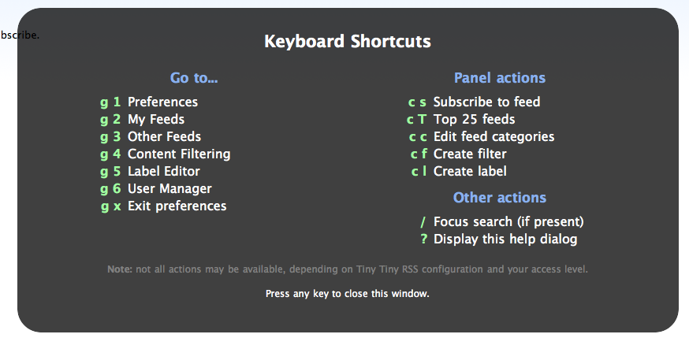

Title: De nouvelles fonctionnalités pour tiny tiny rss + des boutons tiny tiny rss et vimperator
Date: 2008-05-18 09:45
category: misc
tags: tt-rss

Les développeurs de tiny tiny rss sont très sympas, ils ont écouté
ma feature request et l'ont mise en place en un rien de temps.
Maintenant, on a, comme sur google reader, une popup d'aide qui
apparait lorsqu'on cherche un raccourci clavier.

D'ailleurs, j'ai aussi proposé un petit bouton pour faire la pub de
cet excellent lecteur de flux web :

Libre à vous de l'ajouter sur votre site. Au passage, si vous voulez
suivre le développement de tiny tiny rss, je vous conseille de vous
abonner au [flux du forum](http://tt-rss.org/forum/rss.php)... J'ai aussi
fait un bouton pour vimperator!

