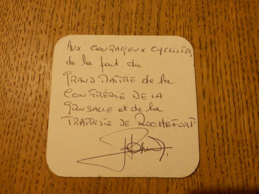

Title: Operations Research and Beer drinking
Category: misc
Date: 2011-11-19 17:06

I am just returning from Charlotte NC, where I had an amazing time at the
INFORMS 2011 conference. Being in the airport waiting for my flight, I
figured out I could use this spare time to share a cool story about
Operations Research.

I happen to be a beer lover. If you're anything like me, you probably know
Belgium produces among the best beers in the world. You also probably know
about the [trappist beers][1], which are some of the most famous and
tastiest beers brewed in the area.

Two years ago, [one of my friends][2] had a crazy idea: He looked at a
map, locating the trappist abbeys producing those excellent beers, and
noticed they all were not very far from each other. He thus proposed a
tour of Belgium that would visit all of them, by bicycle. I was
immediately very enthusiastic about the idea and started to think about
how to make it become true.

Planning the trip
-----------------

So, given 7 cities and a tour to plan (The french abbey of [Mont des
Cats][4] and the german abbey of [Maria Toevlucht][5] had not announced
their plans of brewing their own beers at the time), can you guess what am
I immediately thought about? That's right, the [Travelling Salesman
Problem][3]! Of course, the problem itself is NP-hard, but in practice,
with an instance of this size, it is doable manually.

I could have done it by myself, but this was a unique opportunity to use
[the online solver][6] from the [TSP website][7] of the university of
Georgia Tech! Since we did not actually needed to go back to the first
abbey, I removed the longest edge.

I know what you are thinking: "Are you kidding me? A TSP Problem? If you
remove an edge, this is not a tour, this is an Hamiltonian Path!". You are
completely right, I did not solve the right problem. The thing is, I did
not know any Online Hamiltonian Path Solver at the time, and this was
probably the coolest use I could ever make of Concorde. Still a good
story, isn't it?

Doing it!
---------

Here is the trip as we planned it:

<iframe src="https://www.google.com/maps/embed?pb=!1m54!1m12!1m3!1d1397173.317358605!2d3.0095418362486455!3d50.56817093554189!2m3!1f0!2f0!3f0!3m2!1i1024!2i768!4f13.1!4m39!3e1!4m3!3m2!1d50.048396999999994!2d4.311786!4m5!1s0x47ea8dcefbfe2723%3A0xa95a58f49956f256!2sOrval%2C+Florenville%2C+Belgique!3m2!1d49.6368489!2d5.3472466999999995!4m5!1s0x47c1c946c89a1663%3A0x40099ab2f4d6f20!2sRochefort%2C+Belgique!3m2!1d50.1596036!2d5.2221665!4m3!3m2!1d51.255824999999994!2d5.478648!4m5!1s0x47c6bfc0840d7433%3A0x966840aaf3612c5e!2sKoningshoeven%2C+5018+Tilburg%2C+Pays-Bas!3m2!1d51.551590999999995!2d5.111403!4m5!1s0x47c4003a88a0c5d5%3A0xce12a24262bd5c02!2sWestmalle%2C+Royaume+de+Belgique!3m2!1d51.2968136!2d4.694263299999999!4m5!1s0x47dcc122bb1a2a8d%3A0xc9b50882de0f3896!2sWestvleteren%2C+Vleteren%2C+Belgique!3m2!1d50.927605299999996!2d2.716907!5e1!3m2!1sfr!2sus!4v1448815744468" width="600" height="450" frameborder="0" style="border:0" allowfullscreen></iframe>

We ended up being two (me and my flatmate of the time - Mickael could not
make it) with train tickets to Belgium. Cool facts about this trip:

- We discussed with "le grand maître de [la confrérie de la grusalle et de
  la trappiste de Rochefort][14]".

- We drank some "petit orval", a beer that you can find only at the abbey
  and at the bar ([l'auberge de l'Ange Gardien][13]) and we learned about
  the [legend of Orval][12].
- The lady at the little shop in front of the abbey of Koningshoven (the
  one that brews [la Trappe][8]) was so amazed of what we were doing that
  she gave us a pack of 4 different flavors of Trappes which we brought
  back to France.
- In Gent, there is a barber which is called [bar-bier][15], who (I
  believe) serves bier while shaving the clients.

- Gent and Antwerpen are two of the most beautiful cities I have ever
  seen.

The only sad thing about this trip is that we could not get to drink any
Westvleteren : it is actually [quite hard to get some][9], given the fact
the monks over there have chosen to only produce as much beer as needed to
finance the community: when we arrived, they did not have any beer left.

Conclusion
----------

Three months ago, one of my best friends had the opportunity to get some
Westvleteren and he invited me to taste them, offering me the opportunity
to "finish my trip". For the record, the Westvleteren 12 is ranked the
best beer in the world by [ratebeer.com][10]. Needless to say, I enjoyed
it very much. He let me keep the capsules as a souvenir:

[][11]

[1]: http://en.wikipedia.org/wiki/Trappist_beer
[2]: http://mickaelistria.wordpress.com/
[3]: http://en.wikipedia.org/wiki/Travelling_salesman_problem
[4]: http://fr.wikipedia.org/wiki/Abbaye_du_Mont_des_Cats
[5]: http://trappist-beers.com/8th-trappist-beer-not-from-mont-des-cats-france-but-from-abbey-zundert-netherlands/
[6]: http://www.tsp.gatech.edu/maps/index.html
[7]: http://www.tsp.gatech.edu/index.html
[8]: http://fr.wikipedia.org/wiki/La_Trappe
[9]: http://en.wikipedia.org/wiki/Westvleteren_Brewery#Availability
[10]: http://www.ratebeer.com/
[11]: images/belgium_trip.jpg
[12]: http://en.wikipedia.org/wiki/Orval_Abbey#The_legend_of_Orval
[13]: http://www.orval.be/fr/accueil/auberge.html
[14]: http://www.confreries.be/conf/grusalle/index.htm
[15]: https://maps.google.com/maps?q=9+Sint-Margrietstraat,+Ghent,+Flemish+Region,+Belgium&hl=en&ll=51.058242,3.722069&spn=0.01114,0.027788&sll=51.059112,3.720769&layer=c&cbp=13,181.07,,0,2.78&cbll=51.059172,3.720786&hnear=Sint-Margrietstraat+9,+Gent+9000+Gent,+Oost-Vlaanderen,+Vlaams+Gewest,+Belgium&t=h&panoid=OQiamsdyDTuNWW2nnREx6g&z=16&iwloc=A
